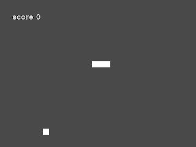

<p dir='rtl' align='right'>
برای شروع کار: ابتدا ماژول را به برنامه اضافه می‌کنیم:
</p>

> import pygame
 <p dir='rtl' align='right'>
 سپس نیاز است که فراخوانی اولیه ماژول در ابتدای برنامه انجام شود:
 </p>
 
 > pygame.init()
 <p dir='rtl' align='right'>
 هدف ما در اینجا نوشتن یک برنامه ساده از شبیه سازی بازی 
 [snake][1] 
 است، با توجه به این که مکان طعمه در هر مرحله تصادفی انتخاب می‌شود، بنابراین به یک مولد اعداد تصادفی هم نیاز خواهیم داشت.
 </p>
 
[1]:https://en.wikipedia.org/wiki/Snake_(video_game_genre) 


```python
import pygame
import random
```


```python
pygame.init()
```


    (6, 0)


<p dir='rtl' align='right'>
پنجره قابل نمایش در 
pygame
، 
screen 
یا صفحه نام دارد.این کلاس هر آنچه که قابل دیدن باشد را شرح می‌دهد. بنابراین ابتدا یک صفحه ایجاد می‌کنیم و اجزای دیگر را بر روی آن صفحه رسم می‌کنیم.

* برای این که پنجره برنامه دارای اسم باشد از دستور زیر برای آن نام تعیین می‌کنیم:
</p>

> pygame.display.set_caption('Snake v 1.0')

<p dir='rtl' align='right'>
* راه انداز گرافیکی در پنجره مستطیلی Surface نام دارد، در واقع این سطح یک handle برای کارهای گرافیکی ما می‌باشد.
سپس برای این که روی این صفحه رنگی اختصاص دهیم، یک پیش زمینه با استفاده از کلاس 
Surface 
تعیین می‌کنیم و آن را با رنگ خاکستری معادل 
(70, 70, 70) 
پر می‌کنیم. این کار را با استفاده از متد
fill 
از کلاس 
Surface 
انجام می‌دهیم.
اما اگر بخواهیم که این پیش زمینه بی‌رنگ ظاهر شود بجای متد
fill 
از دستور زیر استفاده می‌کنیم:
</p>

> background.set_colorkey((0,0,0))

<p dir='rtl' align='right'>
در نهایت با استفاده از متد 
blit 
در صفحه 
screen 
پیش زمینه را در مختصات دلخواه قرار می‌دهیم.
 توجه شود که مبدا مختصات در بالاترین نقطه سمت چپ صفحه قرار دارد.
</p>

```python
pygame.display.set_caption('Snake v 1')
screen = pygame.display.set_mode((640, 480))  # I set Screen size
background = pygame.Surface(screen.get_size())
background.fill((70, 70, 70))
background = background.convert()
screen.blit(background, (0,0))
```


    <rect(0, 0, 640, 480)>

<p dir='rtl' align='right'>
برای ایجاد زمان واقعی از شی
 <i>pygame.time.clock()</i>
استفاده می‌کنیم. هر 
<i>tick()</i> 
از آن یک زمان بر حسب میلی‌ثانیه بر می‌گرداند. این زمان از روی نرخ تعداد فریم‌های نمایشی در هر ثانیه محاسبه می‌شود. بنابراین نیاز است که نرخ فریم از پیش تعیین شده باشد. در اینجا مقدار ۱۵ فریم در ثانیه انتخاب شده است.
مقادیر بزرگ‌تر را خودتان امتحان نمایید.
</p>

```python
clock = pygame.time.Clock()  # this is a clock
FPS = 15  # change frame rate for velocity of Snake 
```
<p dir='rtl' align='right'>
مار قرار است که بر روی یک صفحه رسم شود، و این صفحه بر روی همان 
screen
از پیش تعریف شده مدل می‌شود. نکته مهم این است که صفحه مار باید بی‌رنگ باشد، مگر در جاهایی که خود مار وجود دارد.
</p>

```python
SNAKE_PLANE = pygame.Surface(screen.get_size())
SNAKE_PLANE.set_colorkey((0, 0, 0))
```
<p dir='rtl' align='right'>
تمام برنامه در یک حلقه اصلی قرار دارد و در هر دور حلفه یک فریم از تصویر نمایش داده می‌شود، برای این که این حلقه عمر بی‌نهایت داشته باشد، از حلقه 
 <b>while</b>
استفاده می‌شود. اما برای این که بتوانیم حلقه را گاهی متوقف کنیم از یک عبارت منظقی استفاده می‌کنیم و به طور پیش‌فرض مقدار آن را برابر 
 <b>True</b>
قرار می‌دهیم.
</p>

```python
main_loop = True
```

--------------

<p dir='rtl' align='right'>
تا الان مقدمات را انجام دادیم و حالا آماده هستیم که یک کلاس برای نمایش و کنترل مار تعریف کنیم.
<b>مار</b> 
دارای ویژگی‌های اولیه ساده‌ای می‌باشد. این ویژگی‌ها نیاز است که در همان ابتدای تعریف کلاس مقدار دهی شوند.:
</p>
 
```python
self.points = [(x1,y1), (x2,y2), (x3,y3)] # initial position
self.__score__ = len(self.points) - 3  # score started from 0 and length started from 3
self.__draw__() # A function to draw "Snake" on the "SNAKE_PLANE"
self.direction = 'left' # the direction where snake wants to go
self.length = len(self.points)
self.crash = False  # not crash so you can go on
self.grid = [] # "Screen" is a grid 64 x 48, so each cell has 10 x 10 points area
self.__grow_num__ = 0 # after every collection of food, the length increases by __grow_num__ + 1
for i in range(64):
            for j in range(48):
                self.grid.append((i, j))
self.point_coor = None  # initiate location of food is UnKnown!
self.__create_point__() # A function to set location of food point
```
<p dir='rtl' align='right'>
بنابراین کلاس تعریف شده نیاز به دو تابع یکی برای نمایش و دیگری برای مشخص کردن مکان طعمه خواهیم داشت:

در این تابع هر نقطه موجود در ویژگی 
self.points 
به صورت یک مربع ۱۰ در ۱۰ سفید رنگ بر روی صفحه ظاهر می‌شود.

 تابع grow_up(): این تابع نقاط را برای یک حرکت تغییر می‌دهد.
</p>
 
```python
def __draw__(self):
        global SNAKE_PLANE
        SNAKE_PLANE = pygame.Surface(screen.get_size())
        SNAKE_PLANE.set_colorkey((0, 0, 0))
        self.__grow_up__()
        for point in self.points:
            x, y = point
            pygame.draw.rect(SNAKE_PLANE, (255, 255, 255), (x*10, y*10, 10, 10))
        font = pygame.font.SysFont('ArcadeClassic', size=20)
        text = 'score ' + str(self.__score__)
        txt = font.render(text, True, (211, 211, 211))
        SNAKE_PLANE.blit(txt, (20, 20))
        SNAKE_PLANE = SNAKE_PLANE.convert()
        
        

def __grow_up__(self):
        if snake.__grow_num__ > 0:
            x1, y1 = self.points[-1]
            x0, y0 = self.points[-2]
            if x1 == x0 and y1 == y0 + 1:
                x = x1
                y = y1 - 1
            elif x1 == x0 and y1 == y0 - 1:
                x = x1
                y = y1  + 1
            elif y1 == y0 and x1 == x0 + 1:
                x = x1 - 1
                y = y1
            elif y1 == y0 and x1 == x0 - 1:
                x = x1 + 1
                y = y1
            self.points.append((x, y))
                        
```
<p dir='rtl' align='right'>
برای تعیین مکان و نمایش طعمه از متد زیر استفاده می‌شود:
مشخص است که مکان نقطه نباید توسط مار پر شده باشد:
</p>

```python
def __create_point__(self):
        grid = self.grid[0:]
        for p in self.points:
            try:
                grid.remove(p)
            except:
                pass
        x, y = grid[random.randint(0,len(grid)-1)]
        self.point_putted = True
        self.point_coor = (x * 10, y * 10, 10, 10)
        pygame.draw.rect(SNAKE_PLANE, (0, 0, 0), self.point_coor)
```
<p dir='rtl' align='right'>
همچنین در صورت برخورد سر مار با حاشیه‌های 
screen 
و یا بدن خودش، بازی متوقف می‌شود. بررسی این قضیه توسط متد 
crash 
انجام می‌شود.
</p>

```python
def __crash_check__(self):
        start_point = self.points[0]
        if self.points.count(start_point) != 1:
            self.crash = True
            # print ('Crash')
        x, y = start_point
        if x < 0 or y < 0 or x > 63 or y > 47:
            self.crash = True
            # print ('Crash')
```
<p dir='rtl' align='right'>
توابع برای حرکت در جهات مختلف، که به صورت 
move_left, up, right, down
نوشته می‌شوند. فرم یکی از آن‌ها به صورت زیر است:
</p>

```python
def __move_up__(self):
        start_x, start_y = self.points[0]
        next_x, next_y = self.points[1]
        if start_x == next_x and start_y == next_y + 1:
            go_x = start_x
            go_y = start_y
            self.__move_right__()
        else:
            go_x = start_x
            go_y = start_y - 1
            length = len(self.points)
            for i in range(length):
                if i != length - 1:
                    self.points[length - 1 - i] = self.points[length - 2 - i]
                else:
                    self.points[0] = (go_x, go_y)
       
        self.__draw__()
```
<p dir='rtl' align='right'>
در صورت برخورد سر مار با محل طعمه باید امتیاز یکی اضافه شود:
</p>

```python
def __get_bounce_check__(self):
        point = (self.point_coor[0]/10, self.point_coor[1]/10)
        if self.points[0] == point:
            # print ('got a bounce...')
            self.__create_point__()
            snake.__grow_num__ = snake.__grow_num__ + 1
```

<p dir='rtl' align='right'>
در هر دور از اجرای حلفه اصلی نیاز است که شی **مار** بروز رسانی شود. در این بروز رسانی جهت حرکت دریافت می‌شود، حرکت انجام شده و بررسی می‌شود که آیا امتیاز دریافت شده است یا بازی شکست خورده است.
</p>


```python
def update(self, direction):
        if self.crash is False:
            self.__score__ = len(self.points) - 3
            direction = self.direction if direction == None else direction
            if direction == 'down':
                self.__move_down__()
            elif direction == 'left':
                self.__move_left__()
            if direction == 'right':
                self.__move_right__()
            elif direction == 'up':
                self.__move_up__()
            elif direction == 'paused':
                pass
            self.direction = direction if direction != 'paused' else self.direction
            # self.__create_point()
            pygame.draw.rect(SNAKE_PLANE, (255, 255, 255), self.point_coor)
            self.__get_bounce_check__()
            self.__crash_check__()
```

------
<p dir='rtl' align='right'>
در نهایت کلاس مار به صورت زیر نوشته می‌شود:
</p>

```python
class snake(object):
    '''
    help : ?
    '''
    __grow_num__ = 0
    def __init__(self):
        self.points = [(32, 21), (33, 21), (33,21)]
        self.stack_pos = ['s', 'd', 'd', 'e']
        self.__score__ = len(self.points) - 3
        self.__draw__()
        self.direction = 'left'
        self.length = len(self.points)
        self.crash = False
        self.grid = []
        self.__grow_num__ = 0
        for i in range(64):
            for j in range(48):
                self.grid.append((i, j))
        self.point_coor = None
        self.__create_point__()
        
        
    def __grow_up__(self):
        if snake.__grow_num__ > 0:
            x1, y1 = self.points[-1]
            x0, y0 = self.points[-2]
            if x1 == x0 and y1 == y0 + 1:
                x = x1
                y = y1 - 1
            elif x1 == x0 and y1 == y0 - 1:
                x = x1
                y = y1  + 1
            elif y1 == y0 and x1 == x0 + 1:
                x = x1 - 1
                y = y1
            elif y1 == y0 and x1 == x0 - 1:
                x = x1 + 1
                y = y1
            self.points.append((x, y))

            snake.__grow_num__ -= 1
            # print ((x1, y1), (x0, y0), (x, y))      
            
    def __draw__(self):
        global SNAKE_PLANE
        SNAKE_PLANE = pygame.Surface(screen.get_size())
        SNAKE_PLANE.set_colorkey((0, 0, 0))
        self.__grow_up__()
        for point in self.points:
            x, y = point
            pygame.draw.rect(SNAKE_PLANE, (255, 255, 255), (x*10, y*10, 10, 10))
        font = pygame.font.SysFont('ArcadeClassic', size=20)
        text = 'score ' + str(self.__score__)
        txt = font.render(text, True, (211, 211, 211))
        SNAKE_PLANE.blit(txt, (20, 20))
        SNAKE_PLANE = SNAKE_PLANE.convert()
        
    def __crash_check__(self):
        start_point = self.points[0]
        if self.points.count(start_point) != 1:
            self.crash = True
            # print ('Crash')
        x, y = start_point
        if x < 0 or y < 0 or x > 63 or y > 47:
            self.crash = True
            # print ('Crash')
        
    def __move_left__(self):
        start_x, start_y = self.points[0]
        next_x, next_y = self.points[1]
        if start_y == next_y and start_x == next_x + 1:
            go_x = start_x
            go_y = start_y
            self.__move_down__()
        else:
            go_x = start_x - 1
            go_y = start_y
            length = len(self.points)
            for i in range(length):
                if i != length - 1:
                    self.points[length - 1 - i] = self.points[length - 2 - i]
                else:
                    self.points[0] = (go_x, go_y)
       
        self.__draw__()
        
    def __move_up__(self):
        start_x, start_y = self.points[0]
        next_x, next_y = self.points[1]
        if start_x == next_x and start_y == next_y + 1:
            go_x = start_x
            go_y = start_y
            self.__move_right__()
        else:
            go_x = start_x
            go_y = start_y - 1
            length = len(self.points)
            for i in range(length):
                if i != length - 1:
                    self.points[length - 1 - i] = self.points[length - 2 - i]
                else:
                    self.points[0] = (go_x, go_y)
       
        self.__draw__()
        
    def __move_right__(self):
        start_x, start_y = self.points[0]
        next_x, next_y = self.points[1]
        if start_y == next_y and start_x == next_x - 1:
            go_x = start_x
            go_y = start_y
            self.__move_up__()
        else:
            go_x = start_x + 1
            go_y = start_y
            length = len(self.points)
            for i in range(length):
                if i != length - 1:
                    self.points[length - 1 - i] = self.points[length - 2 - i]
                else:
                    self.points[0] = (go_x, go_y)
       
        self.__draw__()

    def __move_down__(self):
        start_x, start_y = self.points[0]
        next_x, next_y = self.points[1]
        if start_x == next_x and start_y == next_y - 1:
            go_x = start_x
            go_y = start_y
            self.__move_left__()
        else:
            go_x = start_x
            go_y = start_y + 1
            length = len(self.points)
            for i in range(length):
                if i != length - 1:
                    self.points[length - 1 - i] = self.points[length - 2 - i]
                else:
                    self.points[0] = (go_x, go_y)
       
        self.__draw__()
        


    def __create_point__(self):
        grid = self.grid[0:]
        for p in self.points:
            try:
                grid.remove(p)
            except:
                pass
        x, y = grid[random.randint(0,len(grid)-1)]
        self.point_putted = True
        self.point_coor = (x * 10, y * 10, 10, 10)
        pygame.draw.rect(SNAKE_PLANE, (0, 0, 0), self.point_coor)
            
    def __get_bounce_check__(self):
        point = (self.point_coor[0]/10, self.point_coor[1]/10)
        if self.points[0] == point:
            # print ('got a bounce...')
            self.__create_point__()
            snake.__grow_num__ = snake.__grow_num__ + 1
            
    
    def update(self, direction):
        if self.crash is False:
            self.__score__ = len(self.points) - 3
            direction = self.direction if direction == None else direction
            if direction == 'down':
                self.__move_down__()
            elif direction == 'left':
                self.__move_left__()
            if direction == 'right':
                self.__move_right__()
            elif direction == 'up':
                self.__move_up__()
            elif direction == 'paused':
                pass
            self.direction = direction if direction != 'paused' else self.direction
            # self.__create_point()
            pygame.draw.rect(SNAKE_PLANE, (255, 255, 255), self.point_coor)
            self.__get_bounce_check__()
            self.__crash_check__()
```
<p dir='rtl' align='right'>
تابع حلقه اصلی برنامه، تابعی است که در هر دور حلقه اصلی خود منتظر دریافت کلیدی از کاربر می‌شود که مشخص کننده جهت حرکت مار می‌باشد.
برای دریافت کلید نیاز به فعال سازی 
Event Handler
داریم.برای فعال سازی این مورد از توابع 
 <b>pygame.event.get()</b>
استفاده می‌کنیم.
  
در نهایت برای نمایش همه تغییرات و صفحه‌ها نیاز است که بر روی  
screen 
تغییرات با استفاده از متد 
blit 
بروز رسانی شود.
</p>

```python
def main_game():
    Snake = snake()
    direction = 'left'
    main_loop = True
    #k = 1
    while main_loop:
        clock.tick(FPS)
        for event in pygame.event.get():
                if event.type is pygame.QUIT:   # for press (x) sign top of window 
                    main_loop = False
                elif event.type is pygame.KEYDOWN:
                    if event.key == pygame.K_a:
                        direction = 'left'
                    if event.key == pygame.K_w:
                        direction = 'up'
                    if event.key == pygame.K_s:
                        direction = 'down'
                    if event.key == pygame.K_d:
                        direction = 'right'
                    if event.key == pygame.K_p:
                        direction = 'pause'

        Snake.update(direction)
        screen.blit(background, (0,0))
        screen.blit(SNAKE_PLANE, (0,0))
        pygame.display.flip()
        #pygame.image.save(screen, str(k) + '.jpg')
        #k += 1
        if Snake.crash:
            return 0
```
<p dir='rtl' align='right'>
همچنین برای برنامه نیاز داریم که یک منوی اولیه طراحی کنیم. در این قسمت پیش از شروع بازی و اجرای تابع 
main_game 
یک پنجره نمایش داده می‌شود که حاوی کمی توضیحات است.
</p>

```python
if __name__ == '__main__':
    out = None
    while main_loop:
        milliseconds = clock.tick(FPS)
        for event in pygame.event.get():
            if event.type is pygame.QUIT:   # for press (x) sign top of window 
                main_loop = False
            elif event.type is pygame.KEYDOWN:
                if event.key == pygame.K_RETURN:
                    out = main_game()
        if out is None:
            pygame.draw.rect(SNAKE_PLANE, (255, 255, 255), (150, 120, 340, 240))
            SNAKE_PLANE = SNAKE_PLANE.convert()
            font = pygame.font.SysFont('ArcadeClassic', size=25)
            txt = font.render('Press Enter to Start game', True, (0, 0, 0))
            SNAKE_PLANE.blit(txt, (160, 150))
            txt = font.render('or red (x) to close', True, (0, 0, 0))
            SNAKE_PLANE.blit(txt, (160, 180))
            txt = font.render('use w s a d to direction', True, (0, 0, 0))
            SNAKE_PLANE.blit(txt, (160, 210))
            font = pygame.font.SysFont('ArcadeClassic', size=20)
            txt = font.render('P to Pause  Return to Restart game', True, (0, 0, 0))
            SNAKE_PLANE.blit(txt, (160, 240))
        screen.blit(background, (0,0))
        screen.blit(SNAKE_PLANE, (0,0))
        pygame.display.flip()
    pygame.quit()
```



----------

<p dir='rtl' align='right'>
سایر نکات:
</p>

#### رسم شکل هندسی روی Surface:

<p dir='rtl' align='right'>
در این برنامه دو 
Surface 
با نام‌های 
background و SNAKE_PLANE 
تعریف کردیم. پیش از رسم شکل باید توجه داشت که مبدا گوشه سمت چپ بالا می‌باشد و محور عمودی معرف مولفه 
y 
و محور افقی مولفه 
x 
است.در حالت کلی برای رسم شکل مراحل زیر طی می‌شود:
* ایجاد یا انتخاب یک Surface
* استفاده از یک تابع رسم با ورودی Surface
* نمایش Surface بر روی screen با استفاده از متد screen.blit(Surface, (x,y))
</p>

#### توابع رسم در pygame

>```python
Rect = pygame.draw.rect(Surface, tuple(color), tuple(Rect), width=0)
pygame.draw.polygon(Surface, tuple(color), list(pointlists), width=0)
pygame.draw.circle(Surface, tuple(color), tuple(centerpointx,y), radius, width=0) 
Rect = pygame.draw.ellipse(Surface, tuple(color_rgb), tuple(Rect_xywh), width)
pygame.draw.arc(Surface, tuple(color), tuple(Rect), width)
pygame.draw.line(Surface, color, start_pos, stop_pos, width>1)
pygame.draw.lines(Surface, tuple(color), bool(closed), list(points), width)
python.draw.aaline(Surface, tuple(color), start, stop, end, blend=1)
python.draw.aalines(Surface, tuple(color), bool(closed), list(points), blend=1)
```  

<p dir='rtl' align='right'>
که اگر پهنا صفر باشد شکل‌ها به صورت توپر رسم می‌شوند.
</p>

#### رسم شکل در پیش‌زمینه:

>```pyton
bg = pygame.image.load(folder, "....")
bg = bg.convert()
screen.blit(bg, (x,y))
```

#### پخش صدا

<p dir='rtl' align='right'>
ابتدا باید پخش کننده صوتی پیش تنظیم شود: این کار با دستور زیر انجام می‌شود:
</p>

>```python
pygame.mixer.pre.load(44100, -16, 2, 2048)
```

<p dir='rtl' align='right'>
سپس پرونده صوتی را بارگزاری می‌کنیم:
</p>

>```python
m = pygame.music.load("soundfile.wav")
m.play(-1) # non-stop and repeated
```

#### نمایش متن

<p dir='rtl' align='right'>
برای نمایش متن مراحل زیر طی می‌شود:

* تعیین قلم:
</p> 

>```python
pfont = pygame.SysFont("Name", int(size))
```
<p dir='rtl' align='right'>
* تولید متن:
</p>

>```python
text = pfont.render("text", True, tuple(color))
text = text.convert_alpha() # optional
```
<p dir='rtl' align='right'>
* نمایش متن روی صفحه:
</p>

>```python
screen.blit(text, (x,y))
```

[مرجع](pygame.org/docs/ref/draw.html#pygame.draw.rect)
